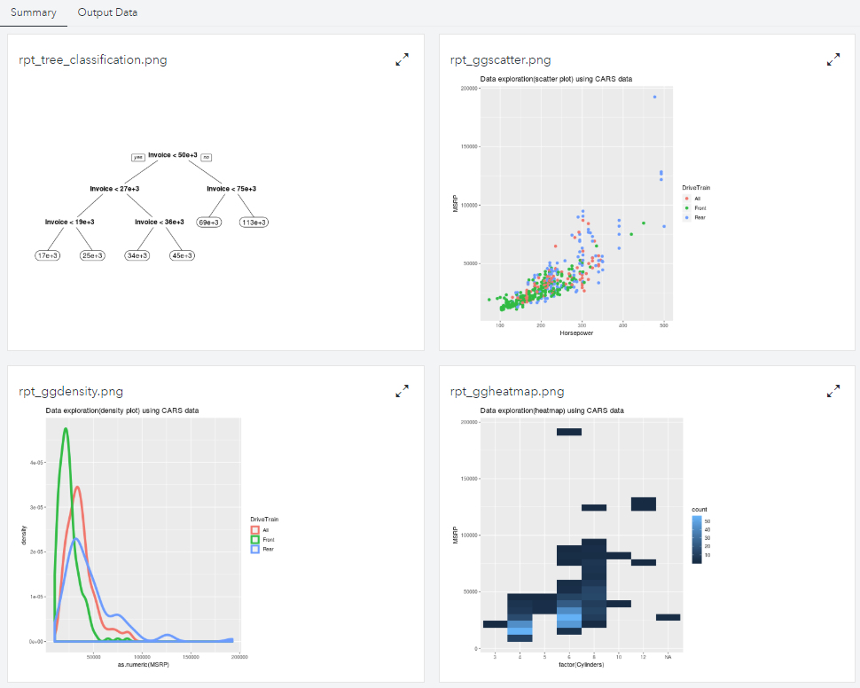

## Visualization using ggplot2 and rpart.plot packages in R

Data: [Cars](https://github.com/sassoftware/sas-viya-programming/blob/master/data/cars.csv)

### Steps to run this example
1. Download "cars.csv" from the link above.

2. Log into SAS Visual Data Mining & Machine Learning 8.3 or later, choose "Build Models" (Model Studio) and create a new project; select the above CSV file as data source with default options.

3. Under Data tab, select MSRP as target variable.

4. Under Pipelines, create a simple pipeline by adding an Open Source Code node after the Data node. (NOTE: If the data has missing values, consider adding Imputation node before Open Source Code node)

5. Select the Open Source Code node and 
   - Change "Language" property to R.
   - Click Open or Open Code Editor button and copy code from gg_plots.r into the code editor
   - Click Save and close the editor

6. Run the pipeline

7. From Open Source Code node, right-click and select Results to view four plots as shown below.

