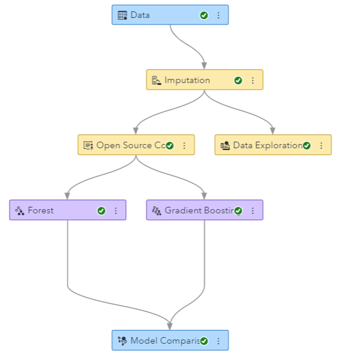

## Use output data in child nodes

This example shows how to use the output data generated in Open Source Code node in subsequent child modeling nodes. **It runs on VDMML 8.5 or later releases.** In VDMML 8.5, there is a new property in Open Source Code node called "Use output data in child nodes" that saves a copy of the output data so as to enable its use in subsequent child nodes. Every time this property is set, a copy of the output data will be saved in the Model Studio project library. When setting this property, make sure NOT to modify the target or the partition variable (if one exists) as that affects model assessment and comparison in Model Comparison node.

Data: [HMEQ data](https://github.com/sassoftware/sas-viya-dmml-pipelines/tree/master/data/hmeq.csv)

Data Description: The data contains observations for 5,960 mortgage applicants. The variable BAD indicates whether the customer has paid on the loan (0) or has defaulted on it (1).

### Steps to run this example
1. Download hmeq.csv file from link above.

2. Log into SAS Visual Data Mining & Machine Learning 8.5, choose "Build Models" (Model Studio) and create a new project; select the above CSV file as data source with default options.

3. Under Data tab, select BAD as target variable.

4. Under Pipelines, create a simple pipeline as shown below using Imputation, Open Source Code, Forest and Gradient Boosting nodes. The Data Exploration node was added to see which variable deviates from normality the most and log transform that variable before modeling.

(**NOTE:** Since HMEQ data has missing values, an Imputation node was added before Open Source Code node)

5. Select Open Source Code node:
   - Click Open button and copy code from uc_log_transform_var.py into the code editor. Click Save and close the editor
   - Select Use output data in child nodes property
   
6. Run the pipeline 

7. From Model Comparison node, right-click and select Results to view comparison of forest and gradient boosting models.
