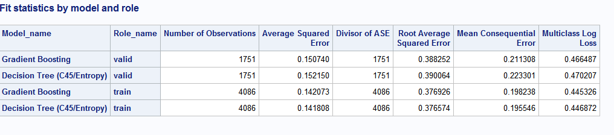
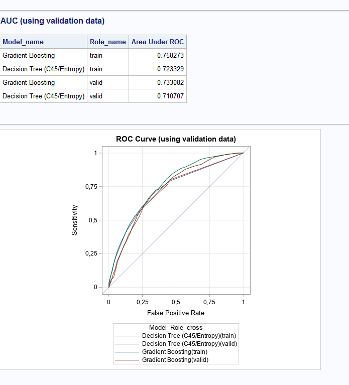

## Purpose 
SAS macro **bin_model_plot_assessments.sas** generates plots/tables for several models and all partitions. In merges scrored datasets and present their comparision by mode or partition (train/test/validation) or shows all modelxparition combination on one graph.

## Parameters

```sas
%bin_model_plot_assessments(
/*binary target */
	target_var=BAD				/*name of the binary target*/
	,event_val=1				/*event value of TARGET */
	,nonevent_val=0				/*non event value of TARGET */
/*scored data inputs */
	,inds_list=	casuser.gb_scored casuser.tree_scored
		/*list of dataset with scored model*/
	,inds_label_list=|Gradient Boosting|Decision Tree (C45/Entropy)|
				/*list of labels to be used for plots/fits stats*/
/*variables in inputs */
	,p_event_var=p_bad1			/*variable with predicted probablity of event */
	,p_nonevent_var=p_bad0		/*variable with predicted probablity of nonevent */
	,partition_var=_partind_	/*name of the variable with partiton identification*/
	,partition_values_list=1|0	/*values of partition_var*/
	,partition_values_label_list=|train|validate|
	/*	labels for partitions values PARTITION_VALUES_LIST*/
	,model_id_var=Model_name
		/*	name of the variable with model identification (generated from INDS_LABEL_LIST)*/
	,Role_id_var=Role_name
		/*	name of the variable with role identification (generated from partition_values_label_list)*/
	,model_role_id_var=Model_Role_cross
	,graphs_by_var=
	/*Role_name*/
/*			plot separate graphs by values of GRAPHS_BY_VAR , if empty all lines are on one graph*/
/*			(use name from ROLE_ID_VAR or name from MODEL_ID_VAR or name from MODEL_ROLE_ID_VAR)*/
	,graphs_group_var=Model_name
		/*	plot separate line on for each values GRAPHS_GROUP_VAR, , if empty all lines are on separated graphs*/
		/*	(use name from ROLE_ID_VAR or name from MODEL_ID_VAR or name from MODEL_ROLE_ID_VAR)*/
);
```

## Outputs



