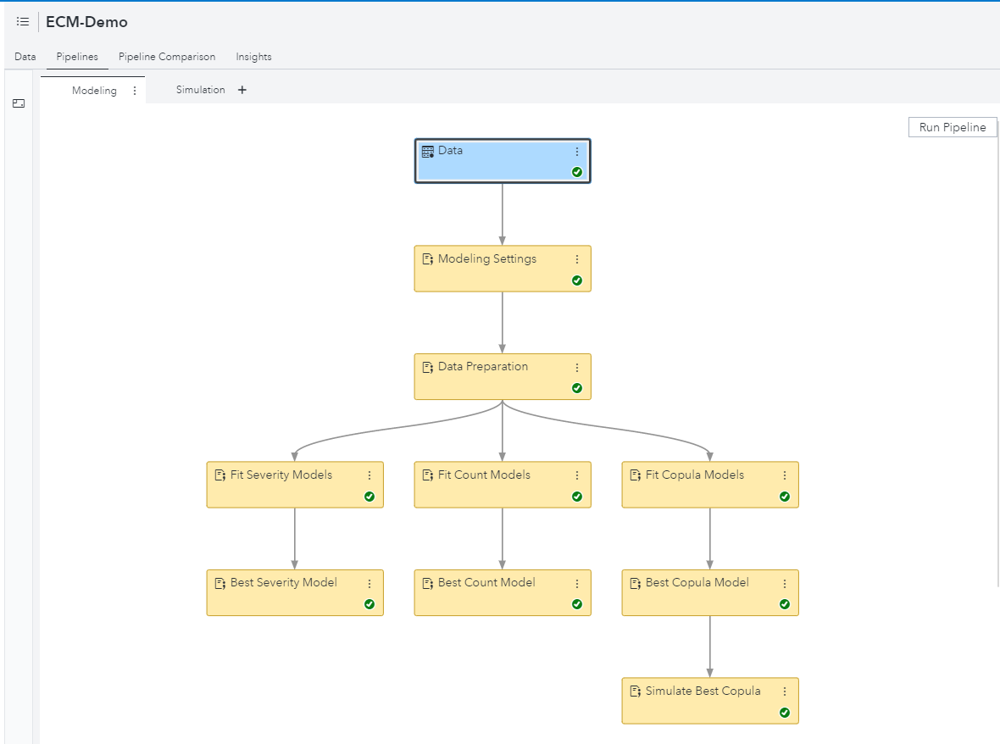
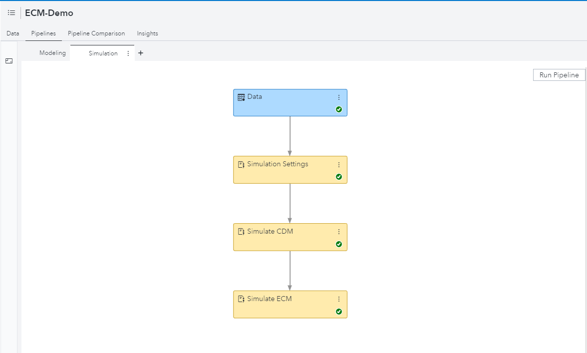
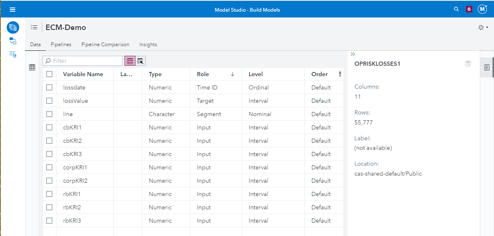

## Summary

The **economic_capital_modeling** folder contains code for various SAS Code nodes that you can use to create 
two pipelines that together estimate an economic capital model (ECM) for an organization.
You need to provide the following:
1. Transactional data table containing losses incurred by that organization it its various lines of business.
2. Scenario data table containing the scenario for which you want to estimate ECM.

After that, you need to create the project with two pipelines, one pipeline for modeling and 
another pipeline for simulation. You can use the SAS programs in the *code* directory to fill
the pipelines by using the following steps:
1. In the Data tab, specify various roles to variables as follows:
    1. Assign *Time ID* role to the time variable that records the time of loss.
    2. Assign *Segment* role to BY variables.
    3. Assign *Target* role to the loss variable that records the magnitude of loss.
    4. Assign *Input* role to any independent (regressor) variables that you want to include in the severity or frequency models.

2. Create the first pipeline and name it "Modeling". It should contain the following configuration of SAS Code nodes:
    1.  "Modeling Settings" node as a child of the "Data" node with code copied from **ECM_Node_P1_N0_UserSettings.sas**.
        Modify the values of macro variables in this node to specify information that is specific to your data.
    2.  "Data Preparation" node as a child of "User Settings" node with code copied from **ECM_Node_P1_N1_DataPrep.sas**. 
        You do not need to modify this code.
    3.  Three children of the "Data Preparation Code" node:
        1.  "Fit Severity Models" node with code copied from **ECM_Node_P1_N21_0_FitSeverity.sas**. 
            You do not need to modify this code.
        2.  "Fit Count Models" node with code copied from **ECM_Node_P1_N22_0_FitCount.sas**.
            You do not need to modify this code.
        3.  "Fit Copula Models" node with code copied from **ECM_Node_P1_N23_0_FitCopula.sas**. 
            You do not need to modify this code.
    4.  "Best Severity Model" node as a child node of "Fit Severity Models" node, with code copied 
        from **ECM_Node_P1_N21_1_BestSeverity.sas**. You do not need to modify this code.
    5.  "Best Count Model" node as a child node of "Fit Count Models" node, with code copied 
        from **ECM_Node_P1_N22_1_BestCount.sas**. You do not need to modify this code.
    5.  "Best Copula Model" node as a child node of "Fit Copula Models" node, with code copied 
        from **ECM_Node_P1_N23_1_BestCopula.sas**. You do not need to modify this code.
    6.  "Simulate Best Copula" node as a child node of "Best Copula Model" node, with code copied 
        from **ECM_Node_P1_N23_2_SimulateCopula.sas**. You do not need to modify this code.
3. Create the second pipeline and name it "Simulation". It should contain the following configuration of SAS Code nodes:
    1.  "Simulation Settings" node as a child of the "Data" node with code copied from **ECM_Node_P2_N0_UserSettings.sas**. 
        Modify the values of macro variables in this node to specify information that is specific to your data.
    2.  "Simulate CDM" node as a child node of "Simulation Settings" node, with code copied 
        from **ECM_Node_P2_N1_Cdm.sas**. You do not need to modify this code.
    3.  "Simulate ECM" node as a child node of "Simulate CDM" node, with code copied 
        from **ECM_Node_P2_N2_Ecm.sas**. You do not need to modify this code.
4. Run first pipeline. Examine results of severity, count, and copula modeling nodes. If you see 
something unexpected, go back to the "Modeling Settings" node and change some settings (macro variables).
5. After you are satisfied with the modeling results, go to the second pipeline and run it. 
Observe the results of the nodes, especially results of the last "Simulate ECM" node, which contain the 
value-at-risk (VaR) and tail value-at-risk (TVaR) estimates and their confidence intervals 
for the scenario you specified. These VaR and TVaR estimates essentially constitute the ECM estimates.
6. If you want to simulate a different scenario or try different simulation settings, you can
modify the settings in the "Simulation Settings" node and re-run the second pipeline.

The Modeling pipeline should look as shown in the image below:

The Simulation pipeline should look as shown in the image below:

Note that you can use different names for nodes and pipelines; the preceding names are chosen
to describe the function of each node and pipeline.

### Sample Project 1
To try this out on a pre-created project, you can use the files in *sampleProject1* directory with 
SAS Visual Data Mining and Machine Learning 8.5:
- **data/oprisklosses1.sashdat** and **data/opriskscenario1.sashdat**: CAS tables
that you should import (load) into Public caslib first.
- **ECM-Demo.zip** file is exported ECM-Demo project. You should import this as Data Mining and 
Machine Learning project (you might need administrative privileges for this operation).
- **settings/ECM_Node_P1_N0_UserSettings.sas** and
**settings/ECM_Node_P2_N0_UserSettings.sas**: SAS code for "Modeling Settings" and 
"Simulation Settings" nodes, respectively.

The variables used in this project and their roles are shown in the image below:

### Important Notes
- To execute the code in these SAS Code nodes, you need to have a license to SAS Econometrics product 
in addition to the license for SAS Visual Data Mining and Machine Learning product.
- This project is not a typical DMML project, because it does not have traditional modeling nodes 
or model comparison node. However, creating such a DMML project offers the following advtanges:
    -   It makes it easy for you to estimate an ECM by focusing only on the data-specific settings 
        and not worry about the details of coding all the modeling and simulation settings.
    -   The severity, count, and copula modeling steps run in parallel thereby making estimation faster.

### Additional resources
- [SAS Econometrics 8.5 User's Guide](https://go.documentation.sas.com/?docsetId=casecon&docsetTarget=casecon_intro_sect001.htm&docsetVersion=8.5&locale=en)
- [An example of Simulating ECM using Sequential Coding Steps](https://go.documentation.sas.com/?docsetId=casecon&docsetTarget=casecon_ecm_examples01.htm&docsetVersion=8.5&locale=en&showBanner=walkup)
