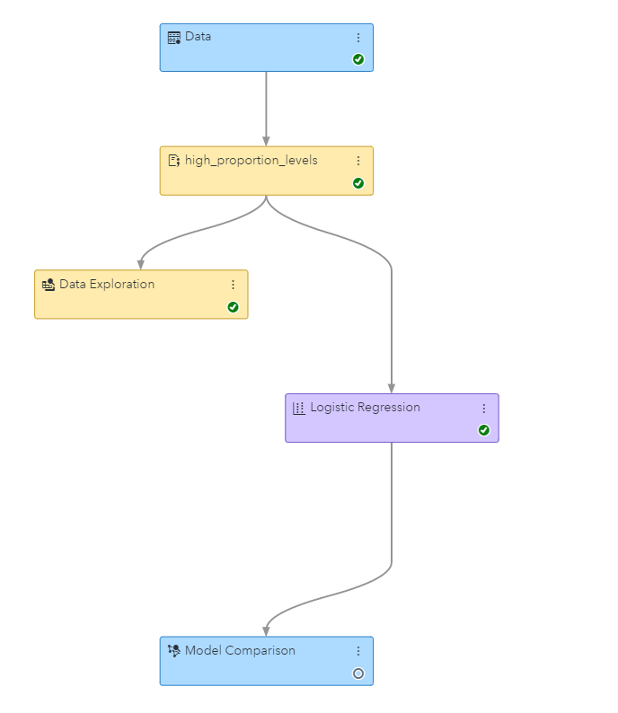
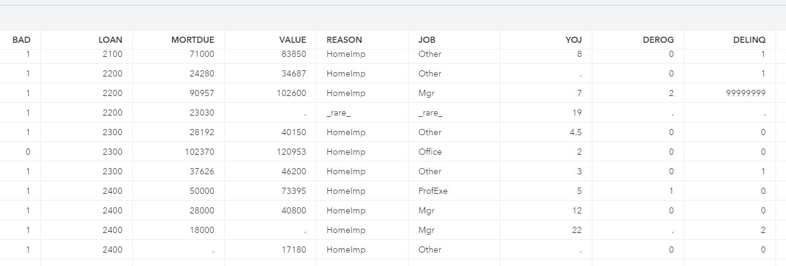

## Purpose 
SAS macro **high_proportion_levels.sas** is designed to reduce number of levels of class variabales to ones having considerable proportion.
It replaces all rare levels (with proportion bellow  the certain limit) by "rare" class for every input class  variable (NOMINAL/BINARY/ORDINAL). 

* Macro optionally works with sample of the input data (to reduce run time). It always runs at CAS. 
* Macro score input dataset (i.e. generates class variables with defined set of levels)
* Generated scoring improves stability of models for new levels (unknown during the training)
* Macro outputs list of identified levels to global macro variables.
* Macro also supports independent  selection of the rare levels.

## Pipeline using SAS Code node high_proportion_levels.sas


## Parameters
```sas
%high_proportion_levels(
	inds=				/*	input dataset, should be in CAS library, default =&DM_DATA*/
	,varlist=			/*list of variables to be scanned*/
						/*	default= %dm_interval_input %dm_binary_input %dm_nominal_input %dm_ordinal_input*/
	,missing=1			/*	include missing values to analysis of proportions*/
	,sample_proportion=		/*	if not empty INDS will be sampled before analyzing proportion */
	,pct_treshold_high_proportion=4	/*proportion [%] of variable values/(class levels) to be selected as high proportion one */
	,pct_treshold_rare_proportion=2		/*proportion [%] of variable values/(class levels) to be selected as rare values */
	,caslib=casuser					/*	CASLIB to be used for intermediate tables/results*/
	,verbose =1						/*	print identified high proportion levels*/
	,prefix_hp_global_mvars=__hp_	/*	prefix of returned global macrovars with list of identified leveles*/
						/*	if not empty generates macrovars with names like __hp_ORIGINAL_VAR*/
	,prefix_rare_global_mvars=__rare_	/*	prefix of returned global macrovars with list of identified leveles*/
						/*	if not empty generates macrovars with names like __rare_ORIGINAL_VAR*/
	,separator_returned_lists=|			/*	separator for values in returned macrovars*/
	,list_of_hp_vars=high_proportion_vars		/*	name of global macrovar with list of macrovars having identified hp levels*/
	,list_of_rare_vars=rare_proportion_vars	/*	name of global macrovar with list of macrovars having identified hp levels*/
	,score_high_proportion=1		/*	flag requesting score code generation that will pass all non high frequency levels to rare group*/
	,rare_group_str=_rare_			/*	label for rare group of character variables*/
	,rare_group_num=99999999		/*	label for rare group of numeric variables*/
);
```
## Output macro variables
```
global mvar set __hp_REASON:|DebtCon|HomeImp
global mvar set __hp_DELINQ:.|0|1|2
global mvar set __hp_DEROG:.|0|1
global mvar set __hp_JOB:|Mgr|Office|Other|ProfExe
global mvar set __hp_NINQ:.|0|1|2|3|4
Lists of vars with high frequency levels set to macrovar high_proportion_vars:__hp_REASON __hp_DELINQ __hp_DEROG __hp_JOB __hp_NINQ

global mvar set __rare_DELINQ:4|5|6
global mvar set __rare_DEROG:3|4|5|6|7|8|9
global mvar set __rare_NINQ:5|6|7|9|11|12
Lists of vars with rare levels set to macrovar high_proportion_vars:__hp_REASON __hp_DELINQ __hp_DEROG __hp_JOB __hp_NINQ
```

## Generated score 
```sas
select (REASON);
when ('DebtCon')   REASON=REASON;
when ('HomeImp')   REASON=REASON;
otherwise	REASON='_rare_';
end;
select (DELINQ);
when (.)   DELINQ=DELINQ;
when (0)   DELINQ=DELINQ;
when (1)   DELINQ=DELINQ;
when (2)   DELINQ=DELINQ;
otherwise   DELINQ=99999999;
end;
select (JOB);
when ('Mgr')   JOB=JOB;
when ('Office')   JOB=JOB;
when ('Other')   JOB=JOB;
when ('ProfExe')   JOB=JOB;
otherwise	JOB='_rare_';
end;
select (NINQ);
when (.)   NINQ=NINQ;
when (0)   NINQ=NINQ;
when (1)   NINQ=NINQ;
when (2)   NINQ=NINQ;
when (3)   NINQ=NINQ;
otherwise   NINQ=99999999;
end;
```

##  Output from score

