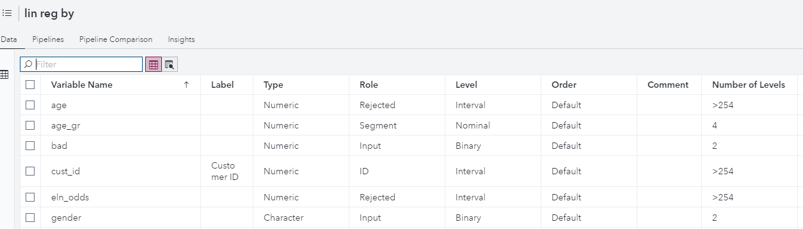
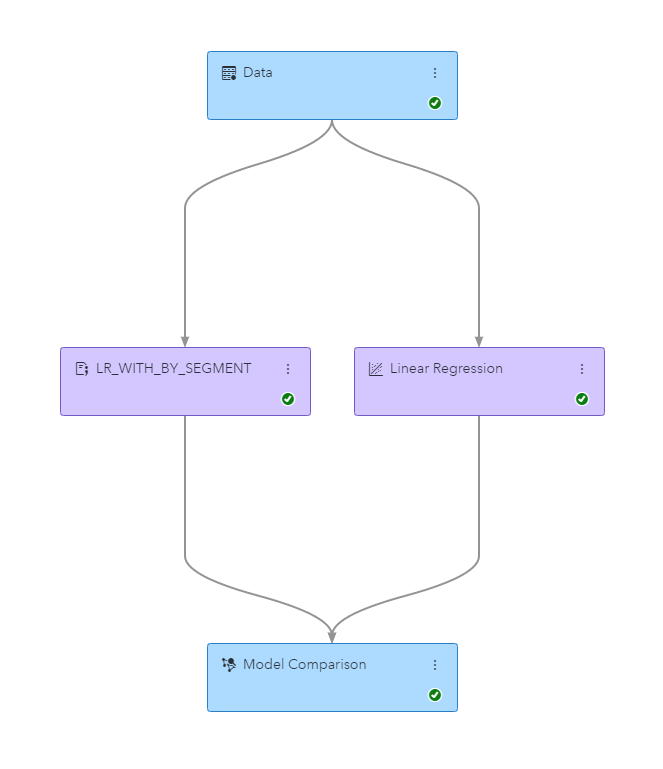

## Purpose 
Using **lin_reg_with_by_segment.sas** in SAS Code Node in SAS Model Studio it is possible to run linear regression (Proc REGSELECT) that generates an indepedent models for each level of the nominal variable (BY variable). 

BY variable for Proc REGSELECT is selected as one having role SEGMENT in the SAS Model Studio project. The other roles of are picked from Data Node metadata: 
- NOMINAL, BINARY and ORDINAL roles are set to the CLASS statement of REGSELECT
- INTERVAL inputs are also used in MODEL statement

Train code will use partitions of input data  as defined in Data node. 
It is possible to change options of REGSELECT procedure, default is STEPWISE selection and use of od validation data for statistics output.
Code will generate valid score code that is used in subsequent nodes, like Model Assement of SAS Model Studio.

## How to use
- Open new SAS Model Studio project 
- open Data tab and 
    * Define interval TARGET role 
    * Assing SEGMENT role to nominal variable

- Add **lin_reg_with_by_segment.sas**  node to Model Studio project, open code editor
    * copy lin_reg_with_by_segment.sas to train window of the SAS Code node
    * Add following code (uncomented) to score window of the SAS Code node) 

`
%include "&score_file";
`

- run SAS Code node  
- move SAS code node to suprevised mode (using right mouse button menu) 
- compare combined linear model with other VDMML models in Model Comparisson node

 
