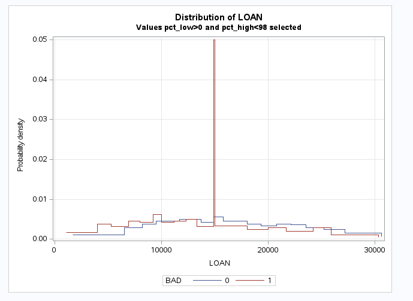

## Purpose 
SAS macro **plot_pdf_interval_var.sas** generates a distribution plots for interval variables that resembles histograms. It actually plots a probability density functions  based on  ranks (number of points is defined by parameter NBINS). This kind of graphs are usefull for data exploration

* Plots are generated for all levels of the selected class variable (BY_VAR parameter). It is typically the binary target variable for which separate lines are shown event and non-event observations. 
* Outliners are optinally stripped from the graphs by a selecting percentile from which values are considered to be outliners (PCT_LOW/PCT_HIGH parameter).
* Macro generates output for the set of interval variables (INTERVAL_VAR_LIST parameter).


## Parameters
```sas
%macro plot_pdf_interval_var(
	cas_sess=			/* 	name of the cas session  (empty for run in Model Studio)*/
	,incaslib=			/*	name of CAS library with input data (empty for run in Model Studio)*/
	,inds=				/*	name of input dataset in incaslib (empty for run in Model Studio)*/
	,interval_var_list=    		/*	list of interval variables to be analyzed 
							(for run in Model Studio: if empty it will be set to Interval vars from train dataset )*/
	,by_var=			/*	plot pdf by by_var (if empty it will be set to TARGET for run in Model Studio) */
	,nbins=100			/*	number of bins in histogram 100=>percentiles*/
	,pct_low=0			/*	lower band of percentiles in % for outliners ,these will not be plotted but only printed */
	,pct_high=100		/*	upper band of percentiles in % for outliners ,these will not be plotted but only printed */
	,nobyplots=0		/*	flag indicator that request separate plots by VAR*/
)/  des='plot histograms like step graphs based on percentiles and PDF';
```

SAS macro **plot_pdf_interval_var.sas** is ready to be included into SAS Code Node inside SAS Model Studio. It will automatically 
* assign train data as input
* find target variable as BY_VAR parameter 
* generate plots for all input variables with INTERVAL level 
  

## Example of output  



